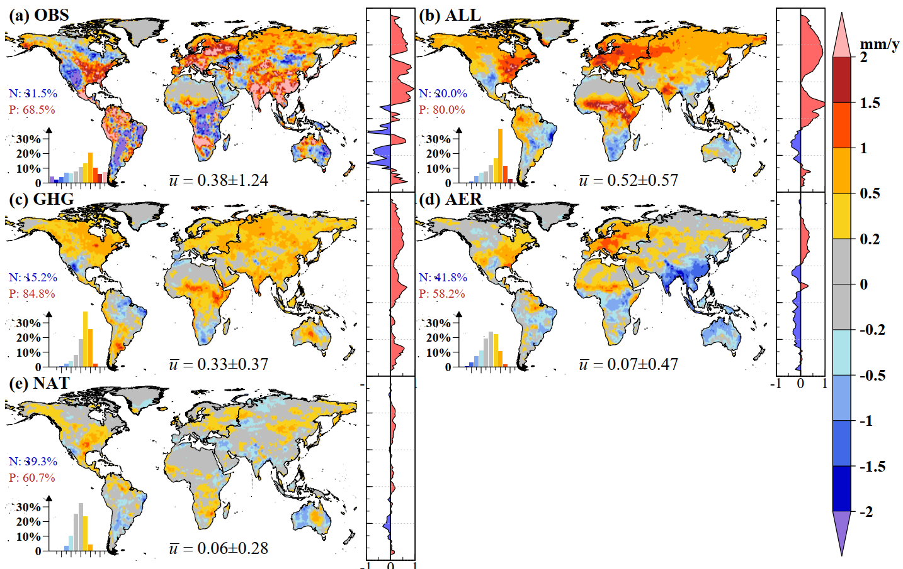
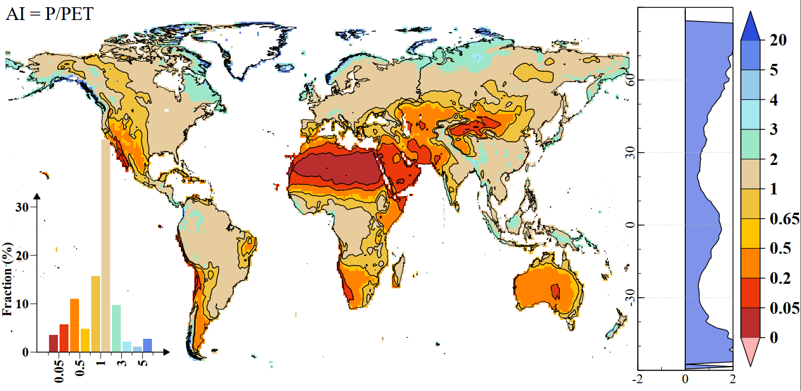

# Liu2021-JGRA-ET_trends

<!-- badges: start -->
<!-- badges: end -->

**Figure1:** ET_trends

**Figure S1:** Aridity Index

# References

1. Liu, J., Zhang, J., Kong, D.\*, Feng, X., Feng, S., & Xiao, M. (2021). Contributions of anthropogenic forcings to evapotranspiration changes over 1980–2020 using GLEAM and CMIP6 simulations. Journal of Geophysical Research: Atmospheres, 126, e2021JD035367. <https://doi.org/10.1029/2021JD035367>
